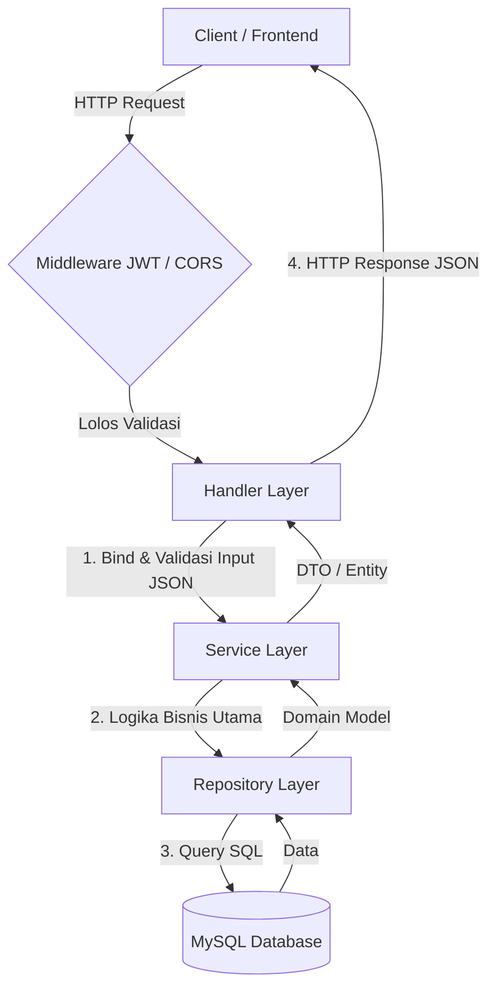

# Go Simple Blog V2

Go Simple Blog V2 adalah project RESTful API untuk platform blog sederhana yang dibangun menggunakan bahasa pemrograman **Go** dengan framework **Gin Gonic**. Project ini merupakan versi peningkatan dari versi pertamanya, dengan penataan kode yang lebih bersih mengikuti prinsip **Clean Architecture (Layered Architecture)** dan sistem autentikasi yang lebih aman menggunakan **JWT (JSON Web Token)**.

## 🚀 Fitur Utama

- **Autentikasi Pengguna**:
  - Pendaftaran Akun (`Sign Up`).
  - Masuk Akun (`Sign In`) dengan pengembalian Access Token (yang disimpan dalam cookie) dan Refresh Token.
  - Refresh Token (`Refresh`) untuk memperbarui masa berlaku session.
  - Pengambilan data profil pengguna (`Get User`).
- **Manajemen Blog & Artikel (Posts)**:
  - Membuat artikel baru (`Create Post`).
  - Melihat semua daftar artikel (`Get All Posts`).
  - Melihat detail artikel berdasarkan ID (`Get Post by ID`).
- **Interaksi Sosial**:
  - Menambahkan komentar pada artikel tertentu (`Create Comment`).
  - Memberikan reaksi/aktivitas (seperti Like, Love, dll.) pada artikel (`User Activity`).
- **Keamanan**:
  - Middleware autentikasi menggunakan token JWT.
  - Validasi token JWT yang dikirimkan melalui cookie HTTP-only atau header.
  - Konfigurasi aplikasi yang terpusat menggunakan library Viper.

---

## 🏗️ Struktur Project

Project ini dirancang menggunakan arsitektur berlapis untuk pemisahan tanggung jawab yang jelas (*Separation of Concerns*):

```text
go-simple-blog-v2/
├── cmd/                # Entrypoint alternatif / CLI commands (jika ada)
├── db/                 # Data penyimpanan database lokal (dihubungkan ke docker volume)
├── internal/           # Berisi kode internal aplikasi yang tidak diekspos ke luar
│   ├── configs/        # Konfigurasi aplikasi (memakai Viper)
│   ├── constants/      # Kumpulan konstanta error & pesan sukses global
│   ├── handlers/       # Layer Handler (HTTP Controller) untuk routing request (Gin)
│   ├── middleware/     # Middleware CORS dan Autentikasi JWT
│   ├── model/          # Representasi data, model database, dan request/response struct
│   ├── repository/     # Layer Repository untuk query & manipulasi data database (MySQL)
│   └── service/        # Layer Service untuk logika bisnis utama (business logic)
├── pkg/                # Helper library/utilitas yang bisa digunakan kembali (JWT, DB connector)
├── scripts/
│   └── migrations/     # File migrasi skema database (.sql)
├── docker_compose.yaml # Konfigurasi Docker compose untuk MySQL database
├── go.mod              # Dependency manager Go
├── Makefile            # Kumpulan shortcut command (migrasi, run, dll)
├── README.md           # Dokumentasi project
└── main.go             # Entrypoint utama aplikasi
```

---

## 🌊 Alur Data (Data Flow)

Alur request-response di dalam project ini mengikuti alur linear Clean Architecture sebagai berikut:



1. **Client / Frontend**: Mengirimkan HTTP Request ke endpoint tertentu (misalnya, membuat postingan baru).
2. **Middleware**: Jika rute tersebut dilindungi (seperti `/posts/*`), Middleware akan mengekstrak token JWT dari cookie `access_token` dan melakukan verifikasi. Jika token tidak valid, request dihentikan dan mengembalikan status `401 Unauthorized`.
3. **Handler Layer (Controller)**: Menerima request yang lolos dari middleware, melakukan *binding* JSON input ke struct model request, lalu meneruskannya ke Service Layer.
4. **Service Layer (Business Logic)**: Memproses logika bisnis (misal: memvalidasi kecocokan password, mengolah teks, dll.), lalu berinteraksi dengan Repository.
5. **Repository Layer (Data Access)**: Menghubungkan logika ke database menggunakan koneksi SQL untuk menyimpan atau mengambil data.
6. **Database**: MySQL menyimpan status data secara persisten.

---

## ⚙️ Konfigurasi & Cara Menjalankan

Untuk menjalankan project ini di komputer lokal Anda, silakan ikuti langkah-langkah di bawah ini:

### Prerequisites (Prasyarat)
Pastikan Anda sudah menginstal alat-alat berikut di komputer Anda:
- [Go](https://go.dev/dl/) (versi 1.20+)
- [Docker & Docker Compose](https://www.docker.com/) (untuk menjalankan database MySQL dengan cepat)
- [Golang-Migrate CLI](https://github.com/golang-migrate/migrate) (opsional, untuk melakukan migrasi database lewat Makefile)

### Langkah-langkah:

#### 1. Clone Repository
```bash
git clone https://github.com/ArielioBayu/go-simple-blog-v2.git
cd go-simple-blog-v2
```

#### 2. Siapkan File Konfigurasi (PENTING)
Demi menjaga keamanan kredensial dan kunci rahasia agar tidak terekspos ke publik (GitHub), file konfigurasi asli `config.yaml` tidak dimasukkan ke dalam repository (diabaikan menggunakan `.gitignore`). 

Anda perlu menduplikat file contoh konfigurasi yang telah disediakan:
1. Masuk ke direktori `internal/configs/`.
2. Salin file `config.yaml.example` dan ubah namanya menjadi `config.yaml`.
3. Buka file `config.yaml` dan sesuaikan kredensial database serta port sesuai kebutuhan Anda.

```bash
# Contoh menyalin file konfigurasi di Linux/macOS
cp internal/configs/config.yaml.example internal/configs/config.yaml

# Contoh menyalin file konfigurasi di Windows (PowerShell)
copy internal/configs/config.yaml.example internal/configs/config.yaml
```

Isi dari `config.yaml` akan terlihat seperti ini (isi dengan konfigurasi milik Anda secara lokal):
```yaml
service:
  port: ":9888" # Port tempat server HTTP berjalan
  secret_key: "kunci_rahasia_jwt_anda" # Kunci rahasia untuk tanda tangan JWT

database:
  dbsourcename: "root:secret@tcp(localhost:3306)/db-simple-blog?parseTime=true&loc=Asia%2FJakarta" # Koneksi MySQL DSN
```

#### 3. Jalankan Database MySQL (Docker)
Gunakan Docker Compose untuk langsung menjalankan instance MySQL lokal yang sudah terkonfigurasi:
```bash
docker-compose up -d
```
*Database MySQL akan berjalan pada port `3306` dengan password root `secret` dan database otomatis terbuat dengan nama `db-simple-blog`.*

#### 4. Jalankan Migrasi Database
Setelah database MySQL berjalan, jalankan migrasi tabel menggunakan command make:
```bash
make migrate-up
```
*Perintah ini akan membaca semua file skema SQL yang berada di dalam folder `scripts/migrations` dan menerapkannya ke database MySQL Anda.*

#### 5. Jalankan Server Aplikasi
Jalankan aplikasi utama:
```bash
go run main.go
```
Server akan mulai mendengarkan request pada port yang ditentukan di `config.yaml` (default `:9888`).

---

## 📌 Daftar Endpoint API

### 👥 Modul Memberships (Autentikasi & Pengguna)
| Method | Endpoint | Auth | Deskripsi |
| :--- | :--- | :--- | :--- |
| **POST** | `/memberships/sign-up` | ❌ No | Pendaftaran akun baru |
| **POST** | `/memberships/sign-in` | ❌ No | Masuk akun, menghasilkan JWT & Refresh token |
| **GET** | `/memberships/get-user` | ❌ No | Mengambil informasi detail akun |
| **POST** | `/memberships/refresh` | ❌ No | Memperbarui masa aktif access token menggunakan refresh token |

### 📝 Modul Posts (Artikel, Komentar, & Aktivitas)
Semua endpoint di bawah ini membutuhkan cookie autentikasi `access_token` yang valid.

| Method | Endpoint | Auth | Deskripsi |
| :--- | :--- | :--- | :--- |
| **POST** | `/posts/create-post` |  Yes | Membuat artikel baru |
| **GET** | `/posts/get-all-post` |  Yes | Mengambil daftar semua artikel |
| **GET** | `/posts/get-post-by-id/:postId`|  Yes | Mengambil detail artikel berdasarkan ID |
| **POST** | `/posts/create-comment/:postId` |  Yes | Memberikan komentar di artikel |
| **POST** | `/posts/user-activity/:postId` |  Yes | Memberikan reaksi/aktivitas (seperti Like/Love) di artikel |
