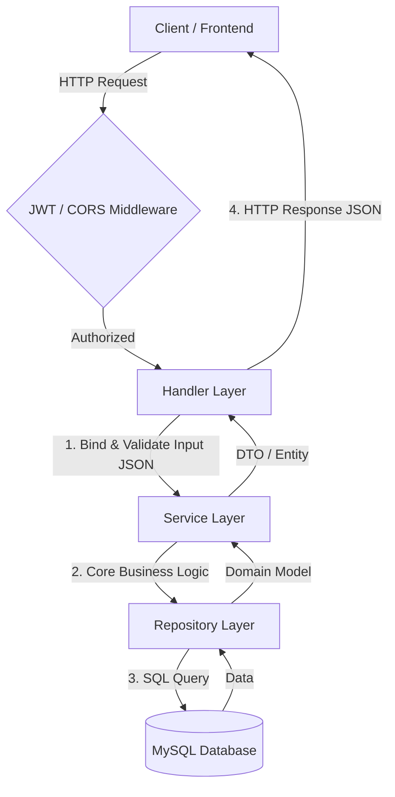

# Go Simple Blog V2

Go Simple Blog V2 is a RESTful API for a simple blog platform built with the **Go** programming language and the **Gin Gonic** web framework. This project is an enhanced version of the first release, featuring a cleaner codebase that adheres to the **Clean Architecture (Layered Architecture)** principles and a secure authentication system using **JWT (JSON Web Tokens)**.

## 🚀 Key Features

- **User Authentication (Memberships)**:
  - Account registration (`Sign Up`).
  - Login (`Sign In`) returning an Access Token (stored in a cookie) and a Refresh Token.
  - Session renewal (`Refresh Token`) using a refresh token.
  - Fetching user profile information (`Get User`).
- **Blog & Article Management (Posts)**:
  - Create a new blog post (`Create Post`).
  - Retrieve all blog posts (`Get All Posts`).
  - Retrieve details of a specific blog post by its ID (`Get Post by ID`).
- **Social Interactions**:
  - Comment on articles (`Create Comment`).
  - React/Interactions (like, love, etc.) on articles (`User Activity`).
- **Security**:
  - Middleware for route authentication via JWT.
  - JWT token validation supported via HTTP-only cookies or Authorization headers.
  - Centralized application configuration using Viper.

---

## 🏗️ Project Structure

The project is structured using layered architecture for clear separation of concerns:

```text
go-simple-blog-v2/
├── cmd/                # Alternative entrypoints / CLI commands (if any)
├── db/                 # Local database storage (mapped to a docker volume)
├── internal/           # Internal application code (not exposed to external packages)
│   ├── configs/        # App configuration loader and yaml configuration (Viper)
│   ├── constants/      # Global error and success messages
│   ├── handlers/       # Handler layer (HTTP controllers & routing using Gin)
│   ├── middleware/     # CORS and JWT authentication middleware
│   ├── model/          # Data representations, database models, and request/response structs
│   ├── repository/     # Repository layer for database CRUD operations (MySQL)
│   └── service/        # Service layer for core business logic
├── pkg/                # Reusable helper packages (JWT utilities, SQL connector)
├── scripts/
│   └── migrations/     # Database schema migration files (.sql)
├── docker_compose.yaml # Docker Compose configuration for MySQL database
├── go.mod              # Go module dependency list
├── Makefile            # Shell shortcuts (run database migrations, run application, etc.)
├── README.md           # Project documentation
└── main.go             # Application entrypoint
```

---

## 🌊 Data Flow

The request-response cycle follows a linear Clean Architecture flow:



1. **Client / Frontend**: Sends an HTTP request to a specific endpoint (e.g., creating a new post).
2. **Middleware**: For protected routes (like `/posts/*`), the middleware extracts the JWT token from the `access_token` cookie and verifies it. If the token is invalid or missing, it aborts the request and returns a `401 Unauthorized` status.
3. **Handler Layer (Controller)**: Receives the request, binds the incoming JSON payload to a request model struct, and passes it to the Service layer.
4. **Service Layer (Business Logic)**: Coordinates the business rules (e.g., password hashing comparison, data validation, permission checks) and calls the Repository layer.
5. **Repository Layer (Data Access)**: Executes SQL queries on the database to read or write data.
6. **Database**: MySQL persists the data.

---

## ⚙️ Configuration & Getting Started

Follow the instructions below to set up and run this project locally:

### Prerequisites
Make sure you have the following installed on your machine:
- [Go](https://go.dev/dl/) (version 1.20+)
- [Docker & Docker Compose](https://www.docker.com/) (to run the MySQL database easily)
- [Golang-Migrate CLI](https://github.com/golang-migrate/migrate) (optional, to run migrations via Makefile)

### Step-by-Step Instructions:

#### 1. Clone the Repository
```bash
git clone https://github.com/ArielioBayu/go-simple-blog-v2.git
cd go-simple-blog-v2
```

#### 2. Set Up the Configuration File
To prevent exposing sensitive credentials (e.g., database passwords, JWT secret keys) to public repositories, the actual `config.yaml` is excluded via `.gitignore`. 

You must copy the template configuration file and configure it:
1. Navigate to the `internal/configs/` directory.
2. Copy `config.yaml.example` to `config.yaml`.
3. Open `config.yaml` and edit the database DSN and service port to match your local setup.

```bash
# On Linux/macOS
cp internal/configs/config.yaml.example internal/configs/config.yaml

# On Windows (PowerShell)
copy internal/configs/config.yaml.example internal/configs/config.yaml
```

The contents of `config.yaml` should look like this:
```yaml
service:
  port: ":9888" # The port where the HTTP server runs
  secret_key: "your_secure_jwt_secret_key" # Secret key for signing JWTs

database:
  dbsourcename: "root:secret@tcp(localhost:3306)/db-simple-blog?parseTime=true&loc=Asia%2FJakarta" # MySQL Connection DSN
```

#### 3. Run the MySQL Database (Docker)
Start the pre-configured MySQL instance using Docker Compose:
```bash
docker-compose up -d
```
*This starts a MySQL instance on port `3306` with the root password `secret` and creates the database `db-simple-blog`.*

#### 4. Run Database Migrations
Once the database container is healthy and running, run the migration scripts to build the database schema:
```bash
make migrate-up
```
*This command runs the SQL scripts in `scripts/migrations` to create the database tables.*

#### 5. Start the Application Server
Run the main application:
```bash
go run main.go
```
The server will start listening on the port configured in `config.yaml` (default is `:9888`).

---

## 📌 API Endpoints

### 👥 Memberships Module (Authentication & User)
| Method | Endpoint | Auth | Description |
| :--- | :--- | :--- | :--- |
| **POST** | `/memberships/sign-up` | ❌ No | Register a new user account |
| **POST** | `/memberships/sign-in` | ❌ No | Authenticate user, returns Access Token (cookie) & Refresh Token |
| **GET** | `/memberships/get-user` | ❌ No | Get details of the authenticated user |
| **POST** | `/memberships/refresh` | ❌ No | Refresh an expired access token using a refresh token |

### 📝 Posts Module (Articles, Comments, & Activities)
All endpoints under the `/posts` path require a valid `access_token` cookie.

| Method | Endpoint | Auth | Description |
| :--- | :--- | :--- | :--- |
| **POST** | `/posts/create-post` |  Yes | Create a new blog post |
| **GET** | `/posts/get-all-post` |  Yes | Retrieve all blog posts |
| **GET** | `/posts/get-post-by-id/:postId`|  Yes | Retrieve details of a specific blog post by its ID |
| **POST** | `/posts/create-comment/:postId` |  Yes | Post a comment on a blog post |
| **POST** | `/posts/user-activity/:postId` |  Yes | Perform user reaction/activity (e.g., Like, Love) on a blog post |
